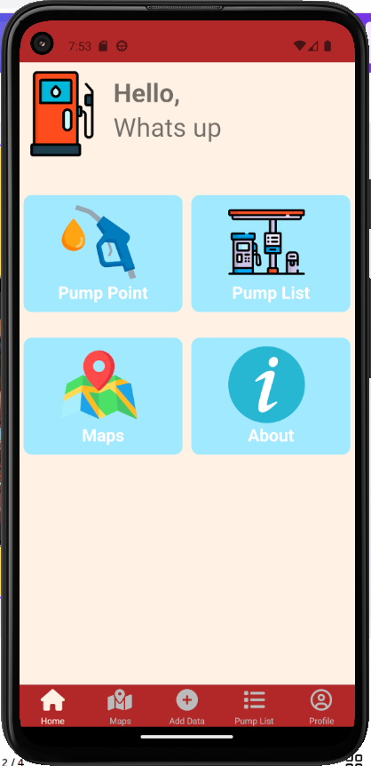
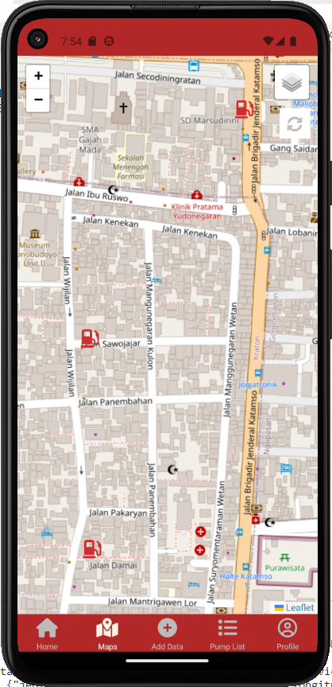
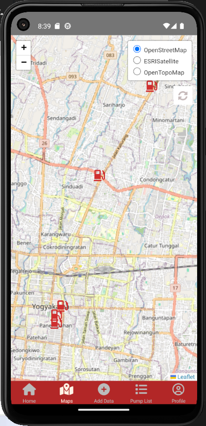
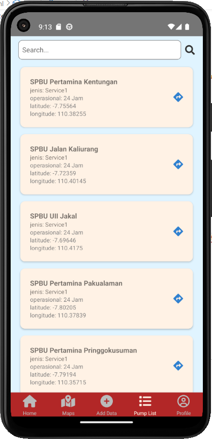
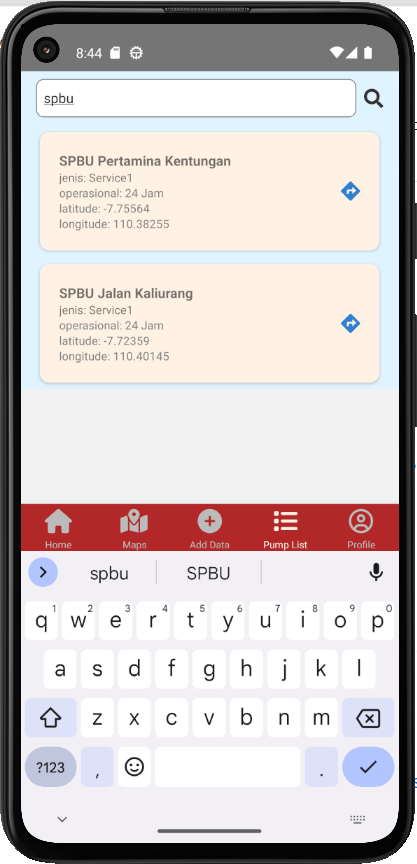
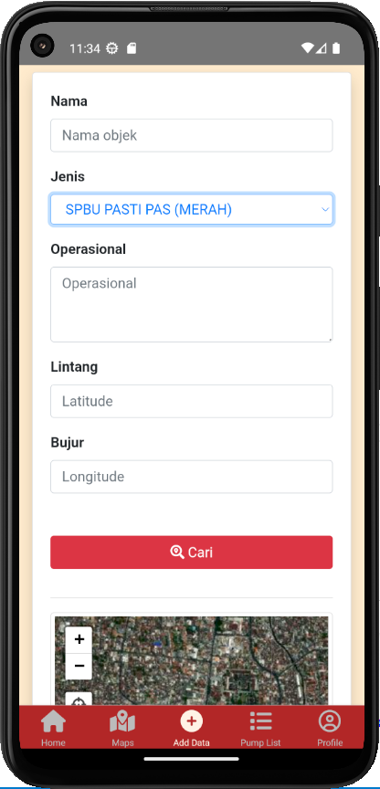

# Nama Produk
Pump Point (Persebaran SPBU di yogyakarta).

# Deskripsi Produk
Aplikasi dibuat dengan framework react native dengan database spreadsheet yang memanfaatkan FetchAPI untuk mengambil data dari database dan juga menggunakan function CRUD pada aplikasi pump point. Aplikasi pump point ini digunakan untuk menampilkan informasi mengenai persebaran SPBU yang ada di Yogyakarta. Aplikasi ini memiliki beberapa fitur yaitu home page, maps page, add data, list data, dan profile. Setiap pagenya dapat dipilih pada menu dengan tampilan bottom tabs.

# Komponen Pembangun produk
1. Framework React Native
2. Spreadsheet
3. Apps Script
4. CRUD
5. Visual Studio Code
6. Javascript
7. Leaflet.js
8. FontAwesome6
9. GitHub
10. Data persebaran SPBU
11. Andoid studio
12. SDK Tool Kit
13. Node.Js

# Sumber Data
Data persebaran SPBU diperoleh dari add data yang acuannya melihat dari google maps.

# Tangkap layar komponen penting dan fitur yang dikembangkan
Home Screen

Maps Screen

Fitur Ganti BaseMap dan reload

Pump List (List data)

Fitur Search data di List

Input Data

Profile Screen

.